<div align="center">

### `DATA ANALYST · ML ENTHUSIAST`

**Mechanical Engineer → Data & AI**

<p>
  <a href="https://github.com/praveenbm0717">GitHub</a>
  &nbsp;·&nbsp;
  <a href="https://www.linkedin.com/in/praveenbm07">LinkedIn</a>
  &nbsp;·&nbsp;
  <a href="mailto:praveenbm0717@gmail.com">Email</a>
</p>

</div>

<p align="center">
  
</p>

---

## About

Mechanical Engineer turned Data Analyst / ML Enthusiast, transitioning into **Data Analytics, Data Science, Machine Learning and AI**.

I focus on building practical data solutions with **Python and SQL**, while strengthening statistics, machine learning fundamentals, data engineering concepts and applied AI.

**Location:** Bengaluru, Karnataka, India

## Current Focus

- Data Analytics and Data Science
- Machine Learning fundamentals
- Practical AI / LLM applications
- SQL and analytical problem solving
- Data cleaning and feature engineering
- Clear technical documentation

## Technical Stack

| Area | Tools / Technologies |
|---|---|
| **Languages** | Python · SQL |
| **Data & Analytics** | Pandas · NumPy · Excel · BigQuery · Matplotlib · Streamlit |
| **Visualization** | Tableau — currently learning |
| **Machine Learning** | Regression · KNN · PCA · Gradient Descent · Perceptron · Cross-Validation |
| **ML Engineering** | Feature Scaling · Encoding · ML Pipelines · ColumnTransformer |
| **AI / LLM** | RAG · Embeddings · LLMs · Function Calling |

## Featured Projects

### AI Expense Tracker

**Python · Streamlit · Google Gemini Function Calling**

A practical expense-tracking application built with Python, Streamlit and Gemini Function Calling.

**Live:** https://expense-tracker-agent.onrender.com

### Cars24 Used-Car Price Prediction

Machine-learning project covering preprocessing, feature engineering and an ML pipeline for used-car price prediction.

### SQL & Data Analytics

Analytical projects using datasets including:

- Zomato
- Cineflix
- Apollo Hospital
- Target

## Learning & Practice

Currently pursuing **Scaler Data Science & Machine Learning (DSML)**.

Current practice includes Python, SQL, statistics, machine learning and applied AI.

- **75+** LeetCode problems
- **120+** assignments

## Education

**B.E. Mechanical Engineering — 2020**  
First Class

## Career Direction

```text
Mechanical Engineering
        ↓
Data Analytics
        ↓
Data Science
        ↓
Machine Learning
        ↓
Applied AI
```

## Connect

- GitHub: https://github.com/praveenbm0717
- LinkedIn: https://www.linkedin.com/in/praveenbm07
- Email: praveenbm0717@gmail.com

---

<p align="center">
  <sub>Building practical data and AI projects, one system at a time.</sub>
</p>
